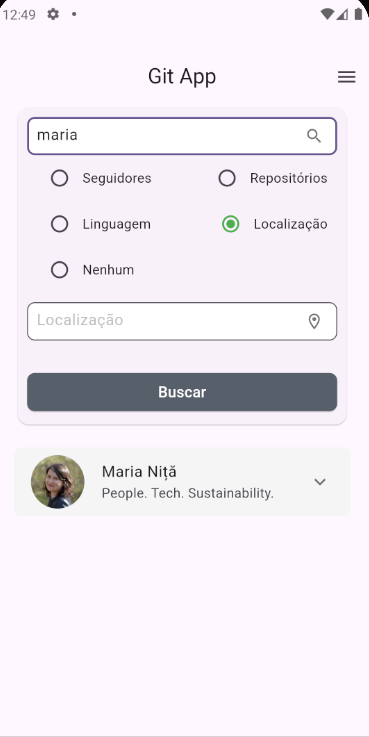
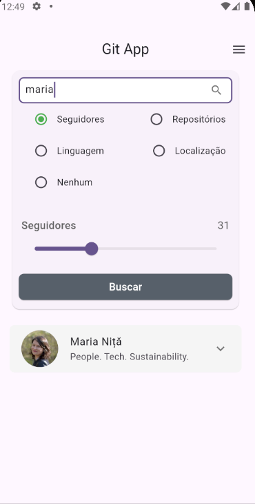
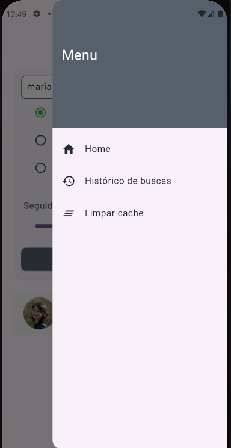
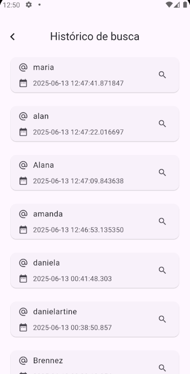

# 📘 GIT app

> Aplicação mobile desenvolvida em Flutter que permite buscar e exibir informações públicas de usuários do GitHub

---

## 📸 Demonstração

|  |  |
|:---------------------------:|:---------------------------:|
| **Home**               | **Busca avançada**               |

|  |  |
|:---------------------------:|:---------------------------:|
| **Opções**               | **Histórico**               |


---

## 🚀 Libs e Tecnologias Utilizadas
- SharedPreferences (Cache de busca local) 
- hive_flutter (Armazenamento local do histórico de buscas)  
- GetX (Gerenciamento de estado)  
- GetIt (Injeção de dependências)
- GOrouter (Rotas e navegação)
- DIO (cliente HTTP)
- Flutter tests e Mockito (testes e criação de mocks)  
- RESTful APIs  

---

## 📦 Instalação e Execução

```bash
# Clone o repositório
git https://github.com/Brennez/Desafio-Minsait.git

# Se preferir, utilize clone com chave SSH utilizando: 
git@github.com:Brennez/Desafio-Minsait.git

# Se preferir, utilize clone com GitHub CLI utilizando: 
gh repo clone Brennez/Desafio-Minsait

# Acesse o diretório
cd Desafio-Minsait

# Instale as dependências
flutter pub get

# Rode a aplicação
flutter run
```
## 📦 Escolhas e Desafios

### Arquitetura 🏛️
O projeto foi estruturado com base nos princípios da arquitetura em camadas, com o objetivo de promover a separação de responsabilidades, facilitar a manutenção e permitir a escalabilidade da aplicação. Para este projeto, optei por uma abordagem com três camadas principais: data, domain e presentation. A camada de domain representa o núcleo da aplicação, a mesma é a responsável pelas entidades, que são objetos centrais e independentes das camadas mais externas, além disso, na camada de domain temos os repositories, que são responsáveis para realizar a comunicação com as camadas mais externas (datasources) e garantem que os dados retornados estejam de acordo com as regras do domínio. A camada de data é responsável por fazer a comunicação externa a aplicação e manipulação de dados, nesse projeto, houve dois tipos de consultas de dados, a primeira externa, utilizando uma comunicação com a API do GitHub para realização das buscas, e a segunda uma manipulação interna, para salvar os dados de cacheamento e o histórico de buscas. Por fim, a camada de presentation é responsável pelo visual da aplicação, nessa camada são desenvolvidas as páginas e componentes em que os usuários irão interagir, além disso, essa camada possui a lógica de gerenciamento de estado da aplicação, que deve conter toda a lógica que controla o estado da tela. Embora a arquitetura em camadas permita a adição de outras estruturas, como a camada de usecases para isolar regras específicas de negócio e orquestração de fluxos, optei por não incluí-la neste projeto por se tratar de uma aplicação de menor complexidade. Dessa forma, a estrutura ficou mais direta, sem comprometer a organização e os princípios da Clean Architecture.

### Tecnologias ✅
Para esse projeto utilizei, libs que facilitam e aprimoram o desenvolvimento, como o [GetX](https://pub.dev/packages/get) embora seja uma biblioteca poderosa que também oferece recursos para navegação e injeção de dependências, optei por limitar seu uso para não acoplar excessivamente a aplicação a uma única solução de terceiros. Para injeção de depedências utilizei o [GetIt](https://pub.dev/packages/get_it), por ser uma lib que já tenho familiriade e ser simples e funcional, para esse projeto seria o ideal. Para requisições HTTP optei pela utilização do [DIO](https://pub.dev/packages/dio), por já possuir familiriade e ser rápido e bastante funcional. Para gerenciamento de rotas utilizei [GoRouter](https://pub.dev/packages/go_router), por ser uma lib que já trabalhei em outras oportunidades e fornecer todo o suporte a rotas e navegação de maneira fluída e eficiente. Como armazenamento local utilizei o [SharedPreferences](https://pub.dev/packages/shared_preferences) para cache de dados localmente e o [Hive Flutter](https://pub.dev/packages/hive_flutter) para armazenamento local do histórico de buscas. O SharedPreferences foi utilizado por ser um modelo simples e eficiente de armazentamento baseado no conceito de chave e valor, que para o objetivo de cachear os dados das buscas seria a escolha ideal, por permitir grande eficiência no salvamento e busca de dados. Por fim, o Hive FLutter foi escolhido por ser um banco de dados NoSql, dessa forma é possível persisitir dados de maneira fácil e eficiente sendo a escolha ideal para a persistência dos dados do histórico.

### Testes 🧪
 Para testes unitários optei por utilizar o [Mockito](https://pub.dev/packages/mockito) para criação de mocks, por serem libs de grande uso na comunidade de flutter e ser eficiente e também por já possuir familiaridade com a mesma.

### Desafios 🚧 
Embora este projeto possa parecer simples à primeira vista, ele envolveu desafios técnicos relevantes durante sua implementação. Um dos principais desafios  foi estruturar uma consulta para realizar busca com base em filtros avançados determinados pelo usuário, utilizando a API pública do GitHub, pois, apesar de a API do GitHub ser uma RESTful API bem documentada, ela é otimizada para acessos diretos e simples a recursos, e não oferece suporte completo a filtros complexos e consultas encadeadas. 

Além disso, acresenta-se que nem todas as informações de filtragem estavam na mesma página, como por exemplo, ao buscar por linguagem de progração, essa informação estava na página de repositórios, enquanto a informação de localização estava na página de usuário, tornando a busca mais complexa. Dessa forma, como melhorias futuras, recomenda-se aprimorar as buscas para retornar resultados mais precisos, buscando informações em páginas distintas e retornando essa informação de forma incremental, depois, a posteriori fazer o tratamento dos dados recebidos e retornar para o usuário apenas o que foi requisitado. 

Além disso, acressenta-se que nem todas as informações de filtragem estavam na mesma página, como por exemplo, ao buscar por linguagem de progração, essa informação estava na página de repositórios, enquanto a informação de localização estava na página de usuário, tornando a busca mais complexa. Dessa forma, como melhorias futuras, recomenda-se aprimorar as buscas para retornar resultados mais precisos, buscando informações em páginas distintas e retornando essa informação de forma incremental, depois, a posteriori fazer o tratamento dos dados recebidos e retornar para o usuário apenas o que foi requisitado. 

Outro desafio, ainda sobre as consultas, como mencionado não consegui realizar o desafio bônus de trazer o número de commits por repositório do usuário, pois essa informação (número de commits) não está presente, por padrão, no retorno da API. Dessa forma, como melhorias acredito ser necessário um estudo mais aprofundado da documentação da API para buscar formas de buscar essa informação.

Por fim, os testes foram um desafio, pois, por não possuir tanta experiência com testes, não pude simular todos os cenários de uso da aplicação e garantir que ela funcione de maneira esperada em todos os cenários possíveis. Dessa forma, optei por implementar testes gerais nas principais funcionalidades para garantir que as funções e métodos principais da aplicação estão funcionando corretamente. Como melhorias, acredito que seja possível aumentar a cobertura e variedades dos testes unitários, garantindo uma gama maior de cenários de uso.

